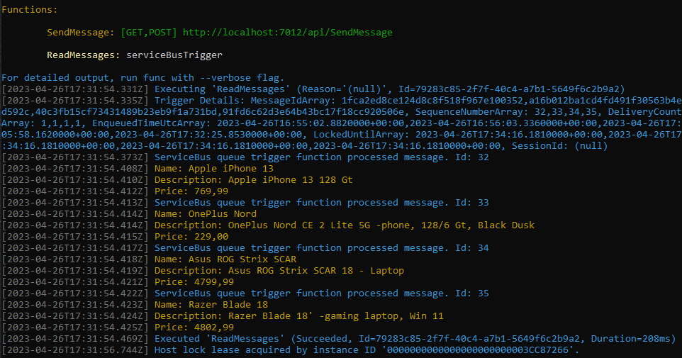
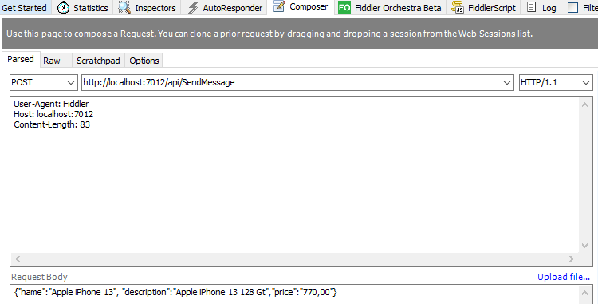
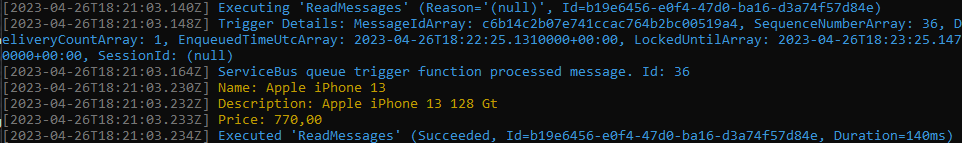

## Azure Functions:  Http and Service Bus Trigger

`.NET C# 6.0, Azure Functions (Function Runtime Version: 4.16.5.20396)`

`Visual Studio Professional 2022`

------

#### 

------

#### **How to run the solution** (Local Computer)

1. Use git to clone a Git repository to a specific folder on your local machine. 
2.  In Azure Service Bus: **1)** *Create Namespace*,  **2)** Create *+Queue* ("**productqueue**") and **3)** Copy "*Primary Connection Key*" (Azure Service Bus Queue Connection String)

3.  Visual Studio (2022)

   - **File** -> **Open** -> **Project/Solutions** -> `AzureServiceBus.sln` 
   - **Replace** `<ServiceBusConnection/>` value in `"local.settings.json"` (Azure Service Bus Queue Connection String)
   - **Debug** -> **Start  Without Debugging** (Ctrl + F5)
   
4.  Send Messages (product) POST (body message):

    ​	http://localhost:7012/api/SendMessage

    

    You can also use `http GET` and `url`-parameters:

    `/api/SendMessage?name=<name>&description=<description>&price=<price>`

5.  Read messages (product) is a **Trigger**:

    #### 

    --

    Default port (7020) can be changed in `properties\launchSettings.json` (in the Solution Explorer).

---

#### Publish to Azure (Microsoft)

https://learn.microsoft.com/en-us/azure/azure-functions/functions-develop-vs?tabs=in-process#publish-to-azure

---

#### Additional Notes

---
[^]: (C) HKuokkanen 26.4.2023. 
